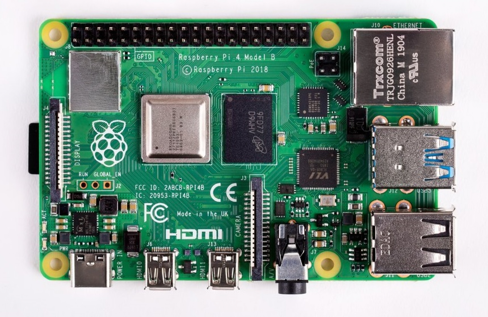
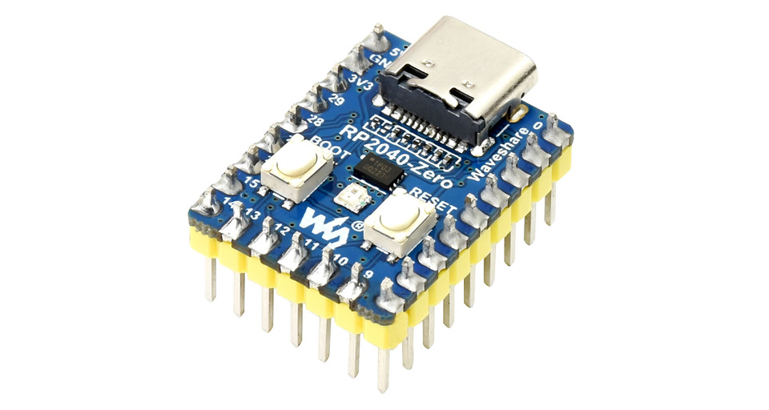
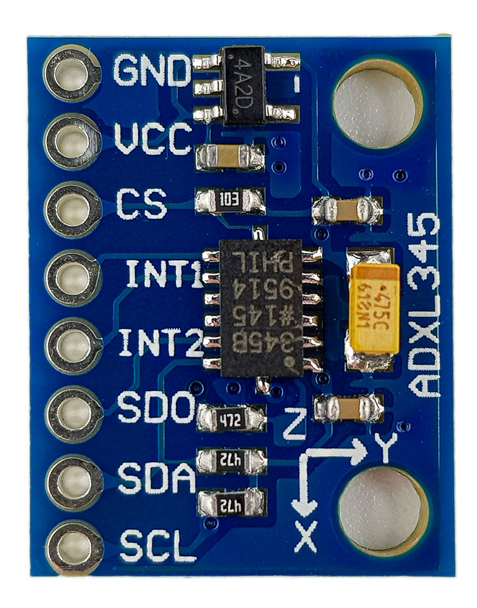
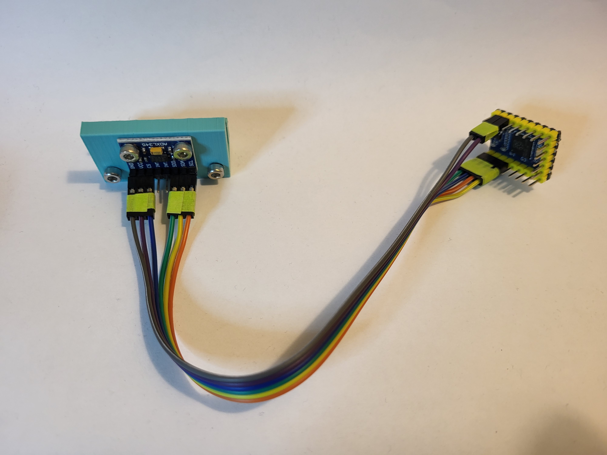
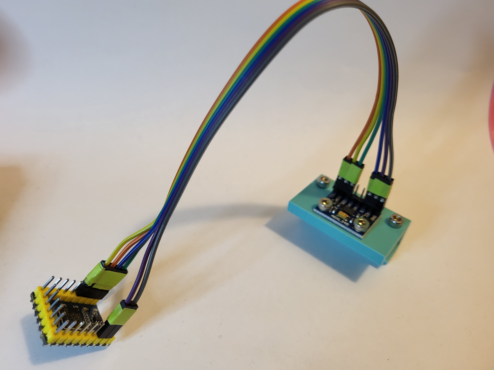
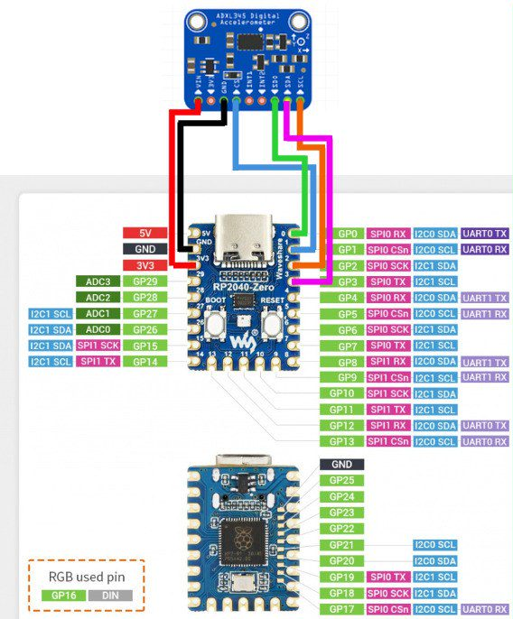

# RP2040-Zero ADXL345 Connection Klipper

### Flashing instructions found [here](./RP2040_Firmware/README.md).

## Connect your ADXL345 to your host Raspberry Pi via a RP2040-Zero



## My mounting solution for the Sovol SV06

I use [this](https://www.printables.com/model/385334-adxl345-mount-for-the-sovol-sv06plus) on my Sovol SV06. I _highly_ recommend using short cables.

 

## Diagram



## Config

```
[mcu RP2040]
baud: 115200
restart_method: command
# Obtain definition by "ls -l /dev/serial/by-id/"
serial: /dev/serial/by-id/usb-Klipper_rp2040_E66138935F154C28-if00

[adxl345]
cs_pin: RP2040:gpio1
spi_bus: spi0a
```

##  Support Me 

Please ⭐ star this repository!

Support [open source](https://en.wikipedia.org/wiki/Open_source), and buy me a [](https://ko-fi.com/bassamanator).

## Sources

- [Link to the Sovol SV06 ADXL345 Mounting Solution](https://www.printables.com/model/385334-sovol-sv06-adxl345-mount-printhead-and-bed)
- [Link to my Sovol SV06 Klipper Config](https://github.com/bassamanator/Sovol-SV06-firmware/tree/master)
- https://github.com/Travis90x/TwoTrees-Sapphire-Plus-SP5-Klipper/tree/main/RP2040_Firmware
- https://travis90x.altervista.org/klipper-adxl345-raspberry-pi-rp2040-zero/?doing_wp_cron=1675003889.0499060153961181640625
