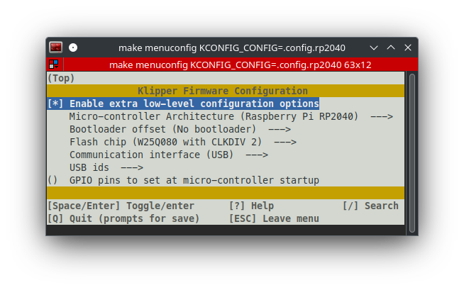

# How to Flash RP2040 with Klipper

## What file to use?

Use `klipper-vXXX.uf2`. Only use `alt-klipper_03H-vXXX.uf2` as a last resort.

## Flashing Instructions

📝 For the sake of simplicity, I will refer to the firmware file as `klipper.uf2` even though the actual filename is something along the lines of `klipper-v0.12.0-116-g31de734d.uf2`.

1. Press and hold `Boot` button on RP2040.
2. Connect RP2040 via usb to your computer.
3. Release `Boot` button.
4. The RP2040 will be mounted as a storage device.
5. Copy `klipper.uf2` to the `root` folder of the RP2040 storage.
6. After the copy (basically a flashing process), the RP2040 will disconnect automatically, and will be ready for use.

# Compilation Instructions

```shell
cd ~/klipper
make menuconfig
# Adjust config settings like in the picture below
make clean
make
```

## Config Settings



## Alternate Config Settings


# Sources

[Source](https://github.com/Travis90x/TwoTrees-Sapphire-Plus-SP5-Marlin/tree/default/Klipper-Firmware/RP2040_Firmware) (this link no longer works)
